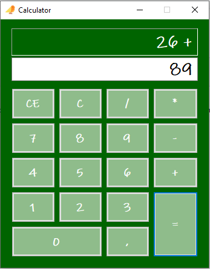

# Calculator
Basic calculator created using Windows forms, .NET Framework Version 4.7.2. Works both with mouse clicks and the numerical pad.

## Preview

## Thanks

Icons made by [Freepik](https://www.flaticon.com/authors/freepik) from [Flaticon](https://www.flaticon.com/)

